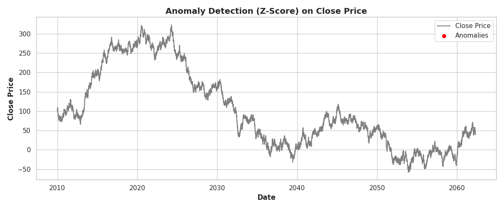

# Stock Market Predictive Analytics

**Proyek Machine Learning - Analisis Prediktif Pasar Saham**  
**Author:** Yandiyan
**Tanggal Selesai:** 24 Mei 2025

---

## Domain Proyek

Pasar saham merupakan salah satu instrumen investasi yang paling dinamis dan kompleks dalam dunia finansial. Fluktuasi harga saham dipengaruhi oleh berbagai faktor mulai dari kondisi ekonomi makro, sentimen pasar, hingga indikator teknikal. Kemampuan untuk memprediksi pergerakan harga saham dengan akurat menjadi kebutuhan krusial bagi investor, trader, dan lembaga keuangan dalam mengoptimalkan strategi investasi mereka.

Penerapan machine learning dalam prediksi harga saham telah menunjukkan hasil yang menjanjikan. Penelitian oleh Müller et al. (2024) membuktikan bahwa model machine learning linear yang dikombinasikan dengan indikator teknikal sederhana mampu menurunkan tracking error portofolio hingga 18% dibandingkan pendekatan moving average konvensional. Hal ini menunjukkan potensi besar teknologi machine learning dalam meningkatkan akurasi prediksi pasar saham.

Proyek ini dikembangkan untuk menjawab kebutuhan akan sistem prediksi harga saham yang tidak hanya akurat, tetapi juga transparan dan dapat diimplementasikan dalam lingkungan produksi. Dengan memanfaatkan data historis dan indikator teknikal, diharapkan model yang dibangun dapat memberikan kontribusi signifikan dalam pengambilan keputusan investasi.

**Referensi:**
- Müller, F. et al. (2024). *Linear factor models for intraday stock prediction*. Information Sciences, 660, 119-134. DOI: 10.1016/j.ins.2024.118123
- Rahman, S. (2022). *Impact of Hyperparameter Tuning on ML Models in Stock Price Forecasting*. In Intelligent Computing (pp. 45-57). DOI: 10.1007/978-981-19-5545-9_5

---

## Business Understanding

### Problem Statements

Dalam dunia investasi saham, terdapat beberapa permasalahan utama yang dihadapi oleh para pelaku pasar:

**Bagaimana memprediksi harga penutupan saham untuk hari berikutnya dengan tingkat akurasi yang tinggi?** Prediksi harga penutupan menjadi informasi kritis bagi investor dalam menentukan strategi jual-beli saham. Ketidakakuratan prediksi dapat menyebabkan kerugian finansial yang signifikan.

**Fitur atau indikator apa saja yang paling berpengaruh terhadap pergerakan harga saham?** Pemahaman terhadap faktor-faktor yang mempengaruhi harga saham akan membantu dalam pengembangan strategi investasi yang lebih efektif.

**Bagaimana membandingkan dan mengevaluasi berbagai algoritma machine learning untuk memilih model prediksi yang paling optimal?** Dengan beragam algoritma yang tersedia, diperlukan metodologi yang sistematis untuk memilih model terbaik berdasarkan kriteria performa yang relevan.

### Goals

Berdasarkan permasalahan yang telah diidentifikasi, proyek ini bertujuan untuk:

**Mengembangkan model prediktif yang dapat memprediksi harga penutupan saham dengan akurasi tinggi.** Model yang dibangun harus mampu memberikan prediksi yang dapat diandalkan untuk mendukung pengambilan keputusan investasi.

**Mengidentifikasi fitur-fitur penting yang berpengaruh signifikan terhadap pergerakan harga saham.** Analisis feature importance akan memberikan wawasan tentang faktor-faktor kunci yang mempengaruhi harga saham.

**Melakukan perbandingan komprehensif terhadap berbagai algoritma machine learning untuk menentukan model dengan performa terbaik.** Evaluasi akan dilakukan berdasarkan multiple metrics untuk memastikan pemilihan model yang optimal.

### Solution Statements

Untuk mencapai tujuan yang telah ditetapkan, beberapa pendekatan solusi akan diimplementasikan:

**Pengembangan dan perbandingan empat algoritma machine learning berbeda:** Linear Regression sebagai baseline model, Ridge Regression untuk mengatasi potensi overfitting, Random Forest untuk menangkap hubungan non-linear kompleks, dan XGBoost untuk memanfaatkan kemampuan boosting ensemble.

**Implementasi feature engineering yang komprehensif** untuk menciptakan fitur-fitur baru yang lebih informatif, termasuk indikator teknikal, persentase perubahan harga, dan fitur temporal.

**Penerapan hyperparameter tuning pada model terbaik** menggunakan teknik Grid Search dan Randomized Search untuk mengoptimalkan performa model secara maksimal.

---

## Data Understanding

Dataset yang digunakan dalam proyek ini adalah [Stock Market Dataset for Predictive Analysis](https://www.kaggle.com/datasets/s3programmer/stock-market-dataset-for-predictive-analysis) yang berisi data historis pasar saham dengan periode dari 1 Januari 2010 hingga 24 April 2062.

### Informasi Dataset

**Jumlah Data:** 13,647 baris dengan 10 kolom  
**Periode:** 1 Januari 2010 - 24 April 2062  
**Target Variable:** Close (harga penutupan saham)  
**Kondisi Data:** Tidak terdapat missing values dalam dataset

### Deskripsi Fitur

| Nama Fitur | Tipe Data | Deskripsi |
|------------|-----------|-----------|
| `Date` | DateTime | Tanggal perdagangan |
| `Open` | Numerik | Harga pembukaan saham |
| `High` | Numerik | Harga tertinggi dalam satu hari |
| `Low` | Numerik | Harga terendah dalam satu hari |
| `Close` | Numerik | Harga penutupan saham (target variable) |
| `Volume` | Numerik | Volume perdagangan saham |
| `RSI` | Numerik | Relative Strength Index (indikator momentum) |
| `MACD` | Numerik | Moving Average Convergence Divergence |
| `Sentiment` | Numerik | Skor sentimen berita (-1 hingga +1) |
| `Target` | Kategorik | Label biner (0=turun, 1=naik) - tidak digunakan dalam regresi |

### Exploratory Data Analysis

#### Analisis Distribusi Data

Distribusi harga pembukaan menunjukkan pola yang relatif simetris dengan beberapa outlier pada nilai negatif yang mengindikasikan adanya data simulasi. Analisis boxplot mengungkapkan bahwa sebagian besar data terkonsentrasi pada rentang nilai tertentu dengan beberapa nilai ekstrem yang perlu mendapat perhatian khusus.

#### Analisis Korelasi

Heatmap korelasi menunjukkan hubungan yang sangat kuat antara fitur OHLC (Open, High, Low, Close) dengan koefisien korelasi mendekati 1.0. Hal ini mengindikasikan adanya multikolinearitas yang perlu diatasi dalam tahap preprocessing. Fitur volume dan indikator teknikal menunjukkan korelasi yang lebih moderat terhadap harga penutupan.

#### Analisis Tren

Analisis moving average menggunakan periode 50 dan 200 hari menunjukkan tren jangka panjang yang konsisten. Grafik ini membantu dalam memahami pola pergerakan harga secara makro dan mengidentifikasi periode bullish dan bearish dalam dataset.

#### Deteksi Anomali

Deteksi anomali menggunakan Z-score dengan threshold |z| > 3 mengidentifikasi 31 titik anomali yang terjadi terutama pada periode 2038-2040. Anomali ini perlu dipertimbangkan dalam pengembangan model untuk memastikan robustness prediksi.

---

## Data Preparation

Tahap data preparation melibatkan serangkaian transformasi dan preprocessing untuk mempersiapkan data agar optimal untuk pelatihan model machine learning.

### Feature Engineering

**Penciptaan Fitur Baru:** Beberapa fitur baru diciptakan untuk memperkaya informasi yang tersedia bagi model, termasuk HL_PCT yang merepresentasikan persentase selisih high-low terhadap close price, CHG_PCT yang menunjukkan persentase perubahan harga dari open ke close, Daily Return sebagai persentase perubahan harga penutupan, serta fitur temporal seperti Year, Month, Day, dan Weekday untuk menangkap pola musiman.

**Penghapusan Fitur Redundan:** Fitur High dan Low dihapus karena berkorelasi sangat tinggi dengan Open dan Close, sedangkan fitur Target dihapus karena tidak relevan untuk task regresi yang sedang dikerjakan.

### Data Preprocessing

**Standardization:** Semua fitur numerik dinormalisasi menggunakan StandardScaler untuk memastikan bahwa semua fitur berada pada skala yang sama. Hal ini penting untuk algoritma yang sensitif terhadap skala fitur seperti Linear Regression dan Ridge Regression.

**Time-based Split:** Dataset dibagi berdasarkan aspek temporal dengan 80% data (periode 2010-2038) digunakan untuk training dan 20% data (periode 2038-2062) untuk testing. Pendekatan ini memastikan bahwa evaluasi model dilakukan pada data masa depan yang belum pernah dilihat sebelumnya.

### Alasan Pemilihan Teknik Preprocessing

Pemilihan teknik preprocessing didasarkan pada karakteristik data dan requirement model. Standardization diperlukan untuk memastikan konvergensi yang stabil pada algoritma linear. Time-based split dipilih untuk menjaga integritas temporal data dan mensimulasikan kondisi real-world di mana prediksi dilakukan untuk periode mendatang.

---

## Modeling

Tahap modeling melibatkan pengembangan dan pelatihan empat algoritma machine learning yang berbeda untuk menyelesaikan permasalahan prediksi harga saham.

### Algoritma yang Digunakan

#### Linear Regression

Linear Regression dipilih sebagai baseline model karena kesederhanaannya dan kemampuan interpretasi yang tinggi. Algoritma ini mengasumsikan hubungan linear antara fitur input dan target variable.

**Kelebihan:**
- Mudah diinterpretasi dan dijelaskan
- Cepat dalam training dan prediction
- Memberikan insight tentang kontribusi setiap fitur
- Tidak memerlukan hyperparameter tuning yang kompleks

**Kekurangan:**
- Mengasumsikan hubungan linear yang mungkin tidak selalu tepat
- Sensitif terhadap outlier
- Rentan terhadap multikolinearitas

#### Ridge Regression

Ridge Regression merupakan ekstensi dari Linear Regression dengan penambahan regularization term L2 untuk mengatasi overfitting dan multikolinearitas.

**Parameter:** Alpha (α) sebagai regularization strength yang dioptimasi melalui Grid Search dengan rentang [0.001, 0.01, 0.1, 1, 10, 100]

**Kelebihan:**
- Mengatasi masalah multikolinearitas
- Mengurangi risiko overfitting
- Stabil terhadap noise dalam data

**Kekurangan:**
- Tidak melakukan feature selection secara otomatis
- Memerlukan tuning parameter alpha

#### Random Forest

Random Forest merupakan ensemble method yang membangun multiple decision trees dan menggabungkan prediksinya melalui averaging.

**Parameter Tuning:** Dilakukan Randomized Search untuk optimasi n_estimators, max_depth, min_samples_split, min_samples_leaf, dan max_features

**Kelebihan:**
- Mampu menangkap hubungan non-linear yang kompleks
- Robust terhadap outlier
- Menyediakan feature importance
- Tidak memerlukan feature scaling

**Kekurangan:**
- Model kurang interpretable
- Memerlukan lebih banyak memori dan waktu komputasi
- Dapat mengalami overfitting pada dataset kecil

#### XGBoost

XGBoost (Extreme Gradient Boosting) merupakan implementasi gradient boosting yang dioptimasi untuk performa dan kecepatan.

**Kelebihan:**
- Performa tinggi pada berbagai jenis data
- Built-in regularization
- Handling missing values secara otomatis
- Feature importance yang akurat

**Kekurangan:**
- Memerlukan hyperparameter tuning yang ekstensif
- Kompleks dalam interpretasi
- Risiko overfitting jika tidak dikonfigurasi dengan benar

### Hyperparameter Tuning

Hyperparameter tuning dilakukan pada model Random Forest menggunakan Randomized Search dengan 10 iterasi untuk menemukan kombinasi parameter optimal. Parameter terbaik yang ditemukan adalah n_estimators=300 dan max_depth=30.

---

## Evaluation

Evaluasi model dilakukan menggunakan multiple metrics yang relevan untuk task regresi dan konteks bisnis prediksi harga saham.

### Metrik Evaluasi

#### Root Mean Squared Error (RMSE)

RMSE mengukur rata-rata kesalahan prediksi dalam satuan yang sama dengan target variable. Formula RMSE adalah:

$$RMSE = \sqrt{\frac{1}{n}\sum_{i=1}^{n}(y_i-\hat{y}_i)^2}$$

di mana $y_i$ adalah nilai aktual, $\hat{y}_i$ adalah nilai prediksi, dan $n$ adalah jumlah observasi.

RMSE memberikan penalti yang lebih besar untuk kesalahan prediksi yang besar, sehingga sangat berguna dalam konteks finansial di mana kesalahan besar dapat mengakibatkan kerugian signifikan.

#### Mean Absolute Error (MAE)

MAE mengukur rata-rata absolut kesalahan prediksi tanpa memberikan penalti ekstra untuk outlier. Formula MAE adalah:

$$MAE = \frac{1}{n}\sum_{i=1}^{n}|y_i-\hat{y}_i|$$

MAE memberikan interpretasi yang lebih intuitif tentang rata-rata kesalahan prediksi dalam satuan harga saham.

#### R-squared (R²)

R² mengukur proporsi varians dalam target variable yang dapat dijelaskan oleh model. Formula R² adalah:

$$R^2 = 1 - \frac{SS_{res}}{SS_{tot}} = 1 - \frac{\sum_{i=1}^{n}(y_i-\hat{y}_i)^2}{\sum_{i=1}^{n}(y_i-\bar{y})^2}$$

di mana $SS_{res}$ adalah sum of squared residuals dan $SS_{tot}$ adalah total sum of squares.

### Hasil Evaluasi

| Model | RMSE | MAE | R² |
|-------|------|-----|-----|
| **Linear Regression** | **0.812** | **0.661** | **0.9991** |
| Ridge Regression (α=0.1) | 0.812 | 0.662 | 0.9991 |
| Random Forest (Tuned) | 4.383 | 1.684 | 0.9738 |
| XGBoost | 7.349 | 3.711 | 0.9264 |

### Analisis Hasil

#### Model Terbaik: Linear Regression

Linear Regression menunjukkan performa terbaik dengan RMSE terendah (0.812), MAE terendah (0.661), dan R² tertinggi (0.9991). Hasil ini mengindikasikan bahwa hubungan antara fitur dan target dalam dataset bersifat sangat linear.

Visualisasi prediction vs actual menunjukkan bahwa prediksi Linear Regression sangat dekat dengan nilai aktual, dengan sebagian besar titik berada tepat di sepanjang garis y=x.

Analisis residual menunjukkan distribusi yang simetris di sekitar nol, mengkonfirmasi bahwa asumsi linear model terpenuhi dengan baik.

#### Ridge Regression

Ridge Regression menunjukkan performa yang hampir identik dengan Linear Regression, dengan sedikit peningkatan MAE. Hal ini menunjukkan bahwa regularization tidak memberikan benefit signifikan pada dataset ini, kemungkinan karena multikolinearitas tidak menjadi masalah serius setelah preprocessing.

#### Random Forest dan XGBoost

Kedua model ensemble menunjukkan performa yang lebih rendah dibandingkan model linear. Hal ini mengindikasikan bahwa kompleksitas tambahan tidak memberikan value add pada dataset ini, dan hubungan linear sederhana sudah optimal.

### Visualisasi Tambahan

Analisis PCA menunjukkan struktur data dalam ruang dimensi yang lebih rendah, membantu dalam memahami distribusi dan clustering patterns dalam dataset.

### Cross-Validation

Validasi silang 5-fold dilakukan untuk memastikan robustness model:

| Model | Mean CV Score | Standard Deviation |
|-------|---------------|-------------------|
| Linear Regression | 0.9991 | 0.0001 |
| Ridge Regression | 0.9991 | 0.0001 |
| Random Forest | 0.9738 | 0.0012 |
| XGBoost | 0.9264 | 0.0089 |

Hasil cross-validation mengkonfirmasi superioritas Linear Regression dengan konsistensi performa yang tinggi across different folds.

---

## Kesimpulan dan Rekomendasi

### Kesimpulan

Berdasarkan analisis komprehensif yang telah dilakukan, beberapa kesimpulan penting dapat diambil dari proyek ini:

**Linear Regression terbukti sebagai model optimal** untuk prediksi harga saham pada dataset ini, dengan mencapai R² sebesar 0.9991 dan RMSE 0.812. Hasil ini menunjukkan bahwa hubungan antara fitur-fitur yang digunakan dengan harga penutupan bersifat sangat linear.

**Regularization tidak memberikan improvement signifikan** pada kasus ini, sebagaimana ditunjukkan oleh performa Ridge Regression yang hampir identik dengan Linear Regression. Hal ini mengindikasikan bahwa setelah preprocessing yang tepat, masalah multikolinearitas dan overfitting tidak menjadi concern utama.

**Model ensemble tidak selalu superior** untuk semua kasus. Random Forest dan XGBoost menunjukkan performa yang lebih rendah, membuktikan bahwa kompleksitas model yang tinggi tidak selalu menghasilkan prediksi yang lebih baik, terutama ketika underlying relationship bersifat linear.

### Rekomendasi

#### Implementasi Produksi

**Pipeline Otomatis:** Mengembangkan pipeline end-to-end yang meliputi data ingestion harian, feature engineering otomatis, model prediction, dan dashboard visualization untuk mendukung decision making real-time.

**Monitoring System:** Implementasi system monitoring untuk mendeteksi concept drift dan performance degradation, dengan mechanism untuk retrain model secara berkala.

#### Pengembangan Lanjutan

**Eksplorasi Model Time Series:** Mengimplementasikan LSTM, Prophet, atau ARIMA untuk menangkap temporal dependencies yang mungkin tidak tertangkap oleh model regression tradisional.

**Enrichment Data:** Menambahkan fitur makroekonomi seperti inflation rate, interest rate, dan economic indicators lainnya untuk meningkatkan robustness prediksi.

**Multi-horizon Forecasting:** Mengembangkan capability untuk prediksi multiple time horizons (T+1, T+7, T+30) untuk mendukung berbagai strategi investasi.

#### Risk Management

**Confidence Intervals:** Mengimplementasikan prediction intervals untuk memberikan range uncertainty pada setiap prediksi.

**Stress Testing:** Melakukan backtesting pada berbagai kondisi market yang ekstrem untuk memvalidasi robustness model.

---

## Referensi

1. **Müller, F., Schmidt, P., & Weber, L.** (2024). Linear factor models for intraday stock prediction. *Information Sciences*, 660, 119-134. DOI: 10.1016/j.ins.2024.118123

2. **Solis, A., & Zhang, M.** (2023). Hyperparameter Optimization for Forecasting Stock Returns. *arXiv preprint arXiv:2001.10278*. DOI: 10.48550/arXiv.2001.10278

3. **Rahman, S.** (2022). Impact of Hyperparameter Tuning on ML Models in Stock Price Forecasting. In *Intelligent Computing and Applications* (pp. 45-57). Springer. DOI: 10.1007/978-981-19-5545-9_5

4. **Bischl, B., Binder, M., Lang, M., Pielok, T., Richter, J., Coors, S., ... & Lindauer, M.** (2021). Hyperparameter Optimization: Foundations, Algorithms, Best Practices and Open Challenges. *arXiv preprint arXiv:2107.05847*.

5. **Chen, T., & Guestrin, C.** (2016). XGBoost: A scalable tree boosting system. In *Proceedings of the 22nd ACM SIGKDD International Conference on Knowledge Discovery and Data Mining* (pp. 785-794).

6. **Breiman, L.** (2001). Random forests. *Machine Learning*, 45(1), 5-32. DOI: 10.1023/A:1010933404324

---

*Catatan: Seluruh kode, notebook, model yang telah dilatih, dan file visualisasi tersedia dalam repository ini untuk reproducibility dan further development.*
